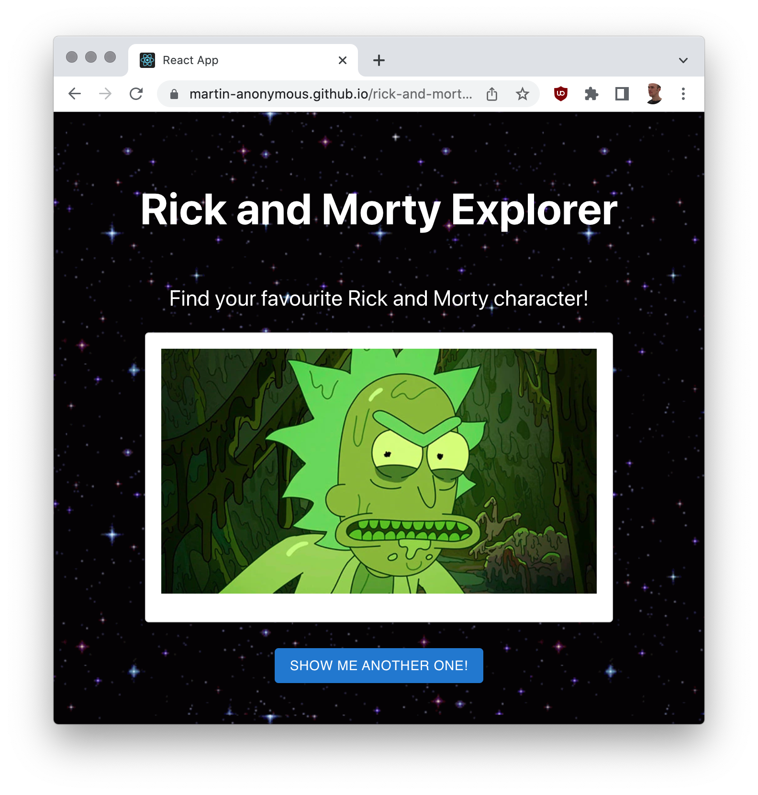

# Rick and Morty explorer

An app to explore the characters of [Rick and Morty](https://en.wikipedia.org/wiki/Rick_and_Morty)

## Why?

This is a work trial task. Requirements:

- Use the [https://rickandmortyapi.com/graphql](https://rickandmortyapi.com/graphql) graphql endpoint ❌
- Add a README to run the app: ❌
- Add a [link to your public git repository](https://github.com/martin-anonymous/rick-and-morty-explorer) ✅
- Add a [demo URL of your application](https://martin-anonymous.github.io/rick-and-morty-explorer/): ✅
- Use
  - [React, typescript, yarn](https://github.com/martin-anonymous/rick-and-morty-explorer/commit/a418a711bdc031a585d57a9aa7c29ffef25ac98a) ✅
  - [MUI](https://github.com/martin-anonymous/rick-and-morty-explorer/commit/cd4255404adcc631e2dfbad36dca0c60912e05d8) ✅
  - yest ❌

- Extra points
  - Simple installation ❌
  - Test coverage ❌
  - Implement [Zustand](https://github.com/pmndrs/zustand) ❌